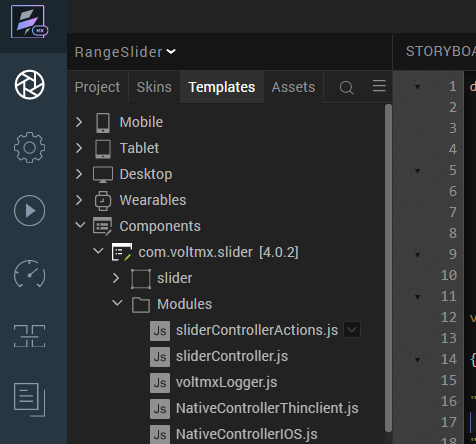

# Range Slider (4.0.2)

## 1.  OVERVIEW

A. The Range Slider component consists of a slider with a minimum value, maximum value, and intervals. A user can move the handles of the slider to select a range between the minimum and maximum values. Use case

- If you want to show flights between \$250 and \$275 specifically when the cost of flights ranging from \$150 to \$500, then, this component will fit in and serve your use case seamlessly.

### B. Features

-   Facility to customize the UI as you require.

-   Slider with a double handle to select a specific range from given range.

-   Easy to achieve the single slider feature without developing it from
    scratch.

-   Ability to define intervals on the slider.

### 

### C. Percentage of re-use:

80-90% (Data can be customizable and skins are not customized but can be changed
manually)

## 2. Getting Started

### A. Prerequisites

Before you start using the RangeSlider component, ensure you have the following:

-   HCL Foundry

-   Volt MX Iris

### B. Platforms Supported

i. Mobile

	1. iOS

	2.Android

ii. Tablets
### 

### C. Importing the Component

 You can import the Forge components only into the apps that are of the Reference Architecture type.

**To import the TimeLine component, do the following:**

1. Open your app project in Volt MX Iris.

2.  In the Project Explorer, click the **Templates** tab.

## 

## 

3.Right-click **Components**, and then select **Import Component**. The **Import
Component** dialog box appears.

4.Click **Browse** to navigate to the location of the component, select the
component, and then click **Import**. The component and its associated widgets
and modules are added to your project.

5.Once you have imported a component to your project, you can easily add the
component to a form. For more information, refer [**Add a Component to a
Form**](https://opensource.hcltechsw.com/volt-mx-docs/docs/documentation/Iris/iris_user_guide/Content/C_UsingComponents.html#add-a-component-to-a-form)**.**

## D. A. Building and previewing the app

After performing all the above steps, you can build your app and run it on your
device. For more information, you can refer to the [Building and Viewing an
Application](https://opensource.hcltechsw.com/volt-mx-docs/docs/documentation/Iris/iris_user_guide/Content/Cloud_Build_in_VoltMX_Iris.html#cloud)
section of the **Volt MX Iris** User Guide.

You can then run your app to see the Timeline work in real time.

## 3. References

### A. Dynamic Usage

You can also add **Range Slider** component dynamically.

To do so:

1\. In the **Project Explorer**, on the **Projects** tab, click **Controllers**
    section to access the respective **Form Controller**. Create a method and
    implement the code snippet similar to the sample code mentioned below.

In the code snippet, you can edit the properties of the component as per
your requirement. For more information, see Setting Properties.

	/* Creating a component's Object */

	var Slider = new com.voltmx.slider (
	{

	"autogrowMode": voltmx.flex.AUTOGROW_NONE,

	"clipBounds": true,

	"height": "20%",

	"id": "Slider",
	
	"isVisible": true,

	"layoutType": voltmx.flex.FREE_FORM,

	"left": "0dp",

	"top": "0%",

	"width": "80%"

	}, {}, {});

	/* Setting the component's properties */

	Slider.minValue = 110;

	Slider.maxValue = 200;

	Slider.minimumIncrementValue = 10;

	Slider.fullRangeEndpointIcon = "Slider.png";

	Slider.selectedRangeEndpointIcon = "Slider_android.png";

	/* Adding the component to the form */

	this.view.add(Slider);

	/* Initializing the component */

	This.view.Slider.initialize();

	}

    **Save** the file.

### **B. Properties**

The properties provided on the **Component** tab allow you to customize the UI
elements in the **RangeSlider** component. You can set the properties directly
on the **Component** tab or by writing a JavaScript.

**1. Minimum Value**

| <!-- -->    | <!-- -->    |
|-------------|-------------|
| **Category:**    | Pass Through                                                     |
| **Description:** | Specifies the minimum value that you want to set on the slider.  |
| **Syntax:**      | minValue                                                         |
| **Type:**        | Number                                                           |
| **Read/Write:**  | Read + Write                                                     | 
| **Example:**     | this.view.componentID.minValue = 10;                             |

**2. Maximum Value**

| <!-- -->    | <!-- -->    |
|-------------|-------------|
| **Category:**    | Pass Through                                                    |
| **Description:** | Specifies the maximum value that you want to set on the slider  |
| **Syntax:**      | maxValue                                                        |
| **Type:**        | Number                                                          |
| **Read/Write:**  | Read + Write                                                    |
| **Example:**     | this.view.componentID.maxValue= 100;                            |

**3. Minimum Increment Value**

| <!-- -->    | <!-- -->    |
|-------------|-------------|
| **Category:**    | Pass Through                                                    |
| **Description:** | Specifies the maximum value that you want to set on the slider  |
| **Syntax:**      | minimumIncrementValue                                           |
| **Type:**        | Number                                                          |
| **Read/Write:**  | Read + Write                                                    |
| **Example:**     | this.view.componentID. minimumIncrementValue= 10;               |

**4. Background Skin**

| <!-- -->    | <!-- -->    |
|-------------|-------------|
| **Category:**    |Pass Through                                               |
| **Description:** | This skin links to the background of the component.       |
| **Syntax:**      | sknBackground                                             |
| **Widget Type:** | FlexContainer                                             |
| **Read/Write:**  | Read + Write                                              |
| **Example:**     | this.view.componentID.sknBackground = "BackgroundSkin";   |

**5. Selected Index Skin**

| <!-- -->    | <!-- -->    |
|-------------|-------------|
| **Description:** | This skin links to the index numbers that are in the selected range.  |
| **Syntax:**      | sknSelectedIndex                                                      |
| **Example:**     | this.view.componentID.sknSelectedIndex = "SelectedIndexSkin";         |
| **Widget Type:** | Label                                                                 |

**6. Unselected Index Skin**

| <!-- -->    | <!-- -->    |
|-------------|-------------|
| **Description:**  | This skin links to the index numbers that are not in the selected range.   |
| **Syntax:**       | sknUnselectedIndex                                                         |
| **Example:**      | this.view.componentID.sknUnselectedIndex = "UnselectedIndexSkin";          |
| **Widget Type:**  | Label                                                                      |

**7.  Selected Range Skin**

| <!-- -->    | <!-- -->    |
|-------------|-------------|
| **Description:** | This skin links to the line that indicates the selected range.  |
| **Syntax:**      | sknSelectedRange                                                |
| **Example:**     | this.view.componentID.sknSelectedRange = "SelectedRangeSkin";   |
| **Widget Type:** | Label                                                           |

## 

## 

## 

### C. Events

You can define events to be executed when an action is performed. You can
configure the events directly on the Actions tab or by writing a JavaScript. To
configure the events on the Actions tab, click Edit against each event. For more
information, refer Add Actions.

This section provides details about each event that help you define the actions
by writing a JavaScript.

**1. OpenonRangeChangeEnd**

| <!-- -->    | <!-- -->    |
|-------------|-------------|
| **Description:** | Invoked when the user releases the handles of the slider. |
| **Syntax:**      | onRangeChangeEnd(values)
| **Parameters:**  | values [Array]Contains the minimum and maximum values of the selected range.
| **Example:**     | this.view.componentID.onRangeChangeEnd = function(values) { alert("Minimum Value: "+values[0]+"; Maximum Value: "+values[1]); }.bind(this);

**2. OpenonRangeChange**

Description: Invoked when the user moves the handles of the slider. This event
gets invoked even if the handle is moving, that is, even if the user does not
release the handle.

Syntax: onRangeChange(values)

Parameters: values [Array]Contains the minimum and maximum values

of the selected range.

Example: this.view.componentID.onRangeChange = function(values)

{

alert("Minimum Value: "+values[0]+"; Maximum Value: "+values[1]);

}.bind(this);

**3. OpenonErrorCallback**

Description: Invoked when an error occurs in the component.

Syntax: onErrorCallback(error)

Parameters: error [JSON]Contains information about the error such as the error
code and error message.

Remarks: If you do not define this event, the component displays an alert when
an error occurs.

Example: this.view.componentID.onErrorCallback = function(error)

{

alert("Error Occured: "+JSON.stringify(error));

}.bind(this);

### D. APIs

The following APIs pertain to the Range Slider component

**1. OpengetSelectedValues**

| <!-- -->    | <!-- -->    |
|-------------|-------------|
| **Description:**  | Fetches the minimum and maximum values of the current selectedrange, that is, the values that are indicated by the left handle and the right handle.                                                                                                         |
| **Syntax:**       | getSelectedValues()                                                                                                                                                                                                                                          |
| **Parameters:**   | None                                                                                                                                                                                                                                                         |
| **Return Value:** | SelectedValues [Array]:   Contains the minimum and maximum values of the selected range.                                                                                                                                                                        |                                                                                                                                                     
| **Example:**      |  var selesctedValues=this.view.componentID.getSelectedValues();  var min = selectedValues[0];    //Minimum value of the selected range (left handle)     var max = selectedValues[1];   //Maximum value of the selected range (right handle)     |                                                                                                  

**2. OpenresetRangeSlider**

Description: Resets the range slider.

Syntax: resetRangeSlider()

Parameters: None

Return Value: None

Remarks: Use this API to reset the slider in the following scenarios:

After you add the component to a form dynamically.

After you change the width of the component at run time.

After a breakpoint change, to enable responsive behavior.

Example: this.view.componentID.resetRangeSlider();

**3. Openinitialize**

Description: Initializes the component.

Syntax: initialize()

Parameters: None

Return Value: None

Remarks: Use this API to initialize the component after you create a component
dynamically.

Example: this.view.componentID.initialize();

###  E. Limitations

-   The component does not support floating point values.

-   To avoid UI distortion, the Minimum Value and Maximum Value properties
    should not contain more than four digits.

-   This component doesn’t support **PWA.**

### F. **Miscellaneous**

-   Make sure that you use the initialize API to initialize the component after
    you create a component dynamically.

-   Make sure that you call the **resetRangeSlider** API in the following
    scenarios.

    -   After you add the component to a form dynamically.

    -   After you change the width of the component at run time.

    -   After a breakpoint change, to enable responsive behaviour.

-   If the component contains a lot of divisions, it can cause the labels of the
    slider to overlap when the slider handles are close to each other.

    -   Make sure that you set the Minimum Increment Value such that the
        component does not contain a lot of divisions.

-   By default, the component displays an alert when an error occurs. If you
    want to add custom actions, you can define the onErrorCallback event.

## 4. Revision History

App version 4.0.2
